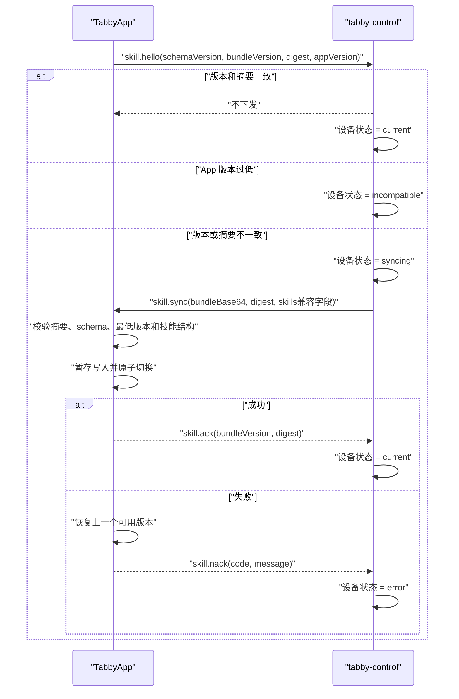

# 手机技能同步设计与运维

## 1. 维护边界

`tabby-control/phone-skills` 是手机操作技能的唯一可编辑源：

- `manifest.json`：协议版本、bundle 版本、最低 App 版本和技能目录清单。
- `apps/<app>/skill.json`：目标包名、技能版本、子技能索引和关键词。
- `apps/<app>/instructions.md`：该 App 的基础操作规则。
- `apps/<app>/references/*.md`：按任务动态选择的细分操作规则。
- `schema/*.schema.json`：源文件结构约束。

`TabbyApp/app/src/main/assets/skills` 是生成的离线基线。手机尚未连接桌面端、
桌面端不可用或首次启动时，代理仍可使用该基线；它不再接受手工修改。

## 2. 构建产物

执行 `npm run phone-skills:build` 后生成：

- `generated/phone-skills.bundle.json`：包含基础指令及所有子技能正文的完整包。
- `generated/phone-skills.manifest.json`：bundleVersion、最低 App 版本、技能版本列表和
  bundle 原始 UTF-8 字节的 SHA-256。

构建不包含时间戳，同一份源文件会产生完全相同的字节和摘要。运行时同步的是该
确定性产物，不在 WebSocket 发送前临时拼接内容。

## 3. 连接与同步



桌面端同时发送 `type` 和 `method`，并保留 `skills` 内联字段。旧版手机可忽略
`bundleBase64` 后按旧协议应用完整技能；新版手机只信任经过摘要校验的 bundle。

## 4. 手机端原子应用

手机端使用三个同分区目录：

- `files/skills`：当前生效版本。
- `files/skills.staging`：新版本暂存目录。
- `files/skills.backup`：切换期间的上一个可用版本。

切换顺序为：写完暂存目录和元数据、当前目录重命名为备份、暂存目录重命名为当前
目录、重新解析并建立包名索引、最后删除备份。进程在任意一步退出时，下次启动会
根据当前目录和备份目录恢复；新目录解析失败时也会回退，不会把半包暴露给代理循环。

## 5. 发布检查

```bash
npm run phone-skills:check
node scripts/build-phone-skills.mjs \
  --check \
  --check-android-assets ../TabbyApp/app/src/main/assets/skills
npm test
```

修改任意技能正文时必须提升 `phone-skills/manifest.json` 的 `bundleVersion`，
再重新生成 bundle 和 Android 基线。App 新增了当前技能摘要、同步状态、失败原因
和最近同步时间到设备状态，桌面端排障时应先看这些字段，不要只看 WebSocket 是否连接。

## 6. 旧仓库迁移

原 `tabby-skill/tabby-rednote` 已被当前小红书 v18 技能覆盖。迁移采用 Android
现有内容作为超集，保留旧仓库规则并包含后来新增的登录、主页、热搜、无图发帖和
回复消息规则。旧仓库仅保留迁移说明和历史，不再作为构建或发布输入。
